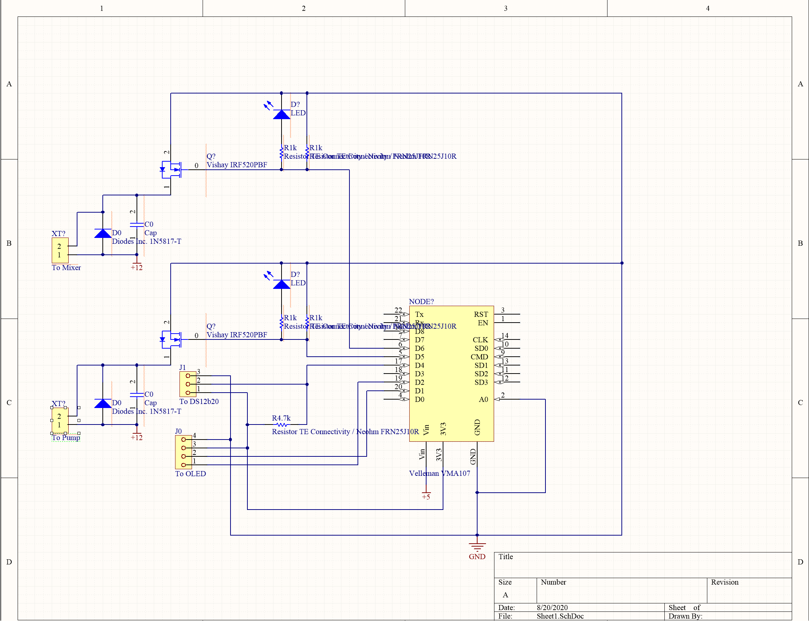

# dosingpump
Uses a cheap 12V peristaltic pump and an ES8266 to dose chemicals into an aquarium using Micro Python.

I also decided to add a temperature probe to the aquarium just to track temps. I will probably
send this to a MQTT server and use Home Assistant to graph/track the information.

## Pinout

* D1 -> OLED scl
* D2 -> OLED sda
* D4 -> DS18b20 data
* D5 -> IRF520 sig - pump
* D6 -> IRF520 sig - mixer

NOTE: need a 47nF capacitor across the output of the DC Motor Driver
NOTE: need a 1N5817 diode across the output of the DC Motor Driver

